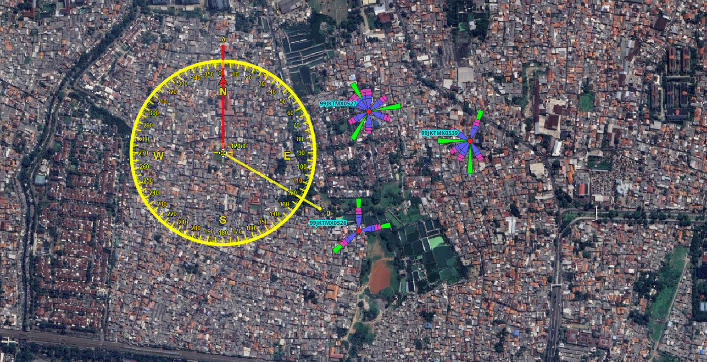
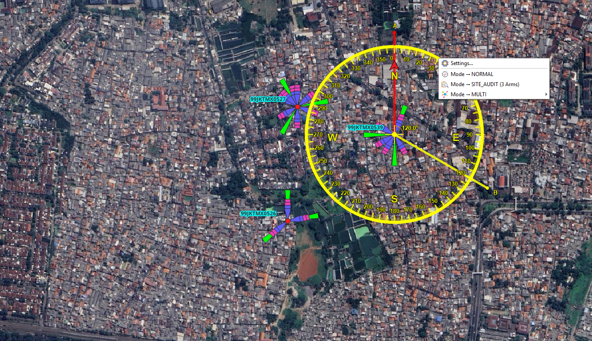
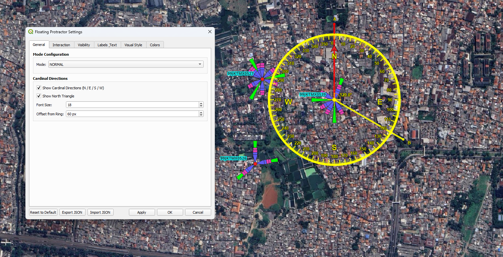

# FloatingCompass  
### Lightweight Floating Compass & Protractor Overlay for QGIS

FloatingCompass is a lightweight QGIS plugin that provides a draggable floating compass and protractor overlay for precise azimuth visualization directly on the map canvas.

Designed for RF engineers, telecom planners, GIS analysts, and spatial professionals who require quick directional validation without complex workflows.

---

## 🚀 Features

- Draggable floating compass overlay
- Real-time azimuth visualization
- Protractor angle reference
- Right-click settings panel
- Lightweight and canvas-safe implementation
- No external dependencies

---

## 📸 Screenshots

### Draggable Floating Compass

### Right Click Settings

### Settings Dialog

---

## 🛠 Technical Details

- Compatible with QGIS 3.22+
- CRS-aware canvas rendering
- Overlay-based architecture
- Toolbar-safe lifecycle handling
- Designed for stable production usage

---

## 🎯 Use Cases

- LTE / NR azimuth validation
- Sector direction checking
- RF optimization workflows
- Field verification support
- Educational GIS demonstrations

---

## ⚖️ License

This plugin is released under the GNU General Public License v3.0 or later.

See the LICENSE file for details.

---

## 👨‍💻 Author

Achmad Amrulloh