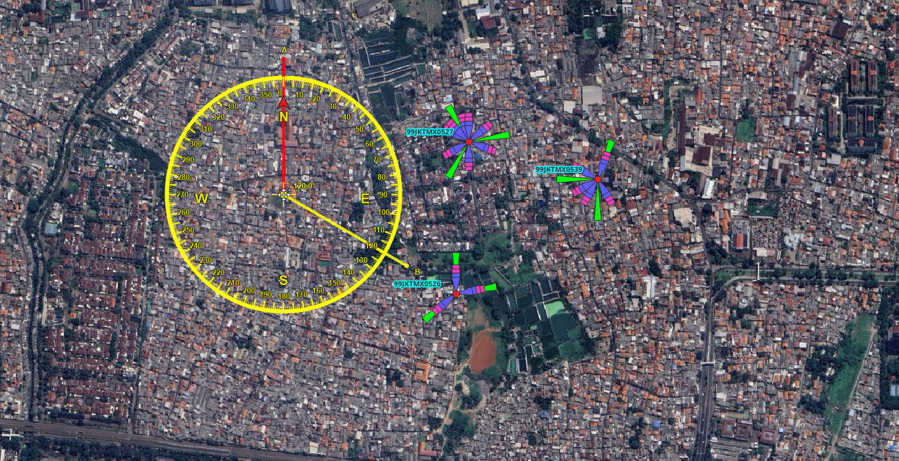
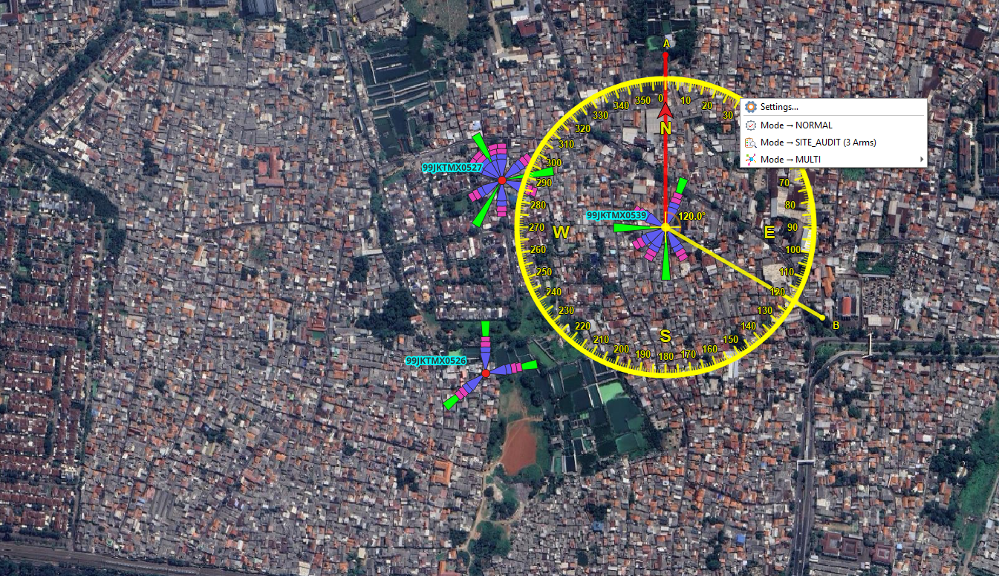
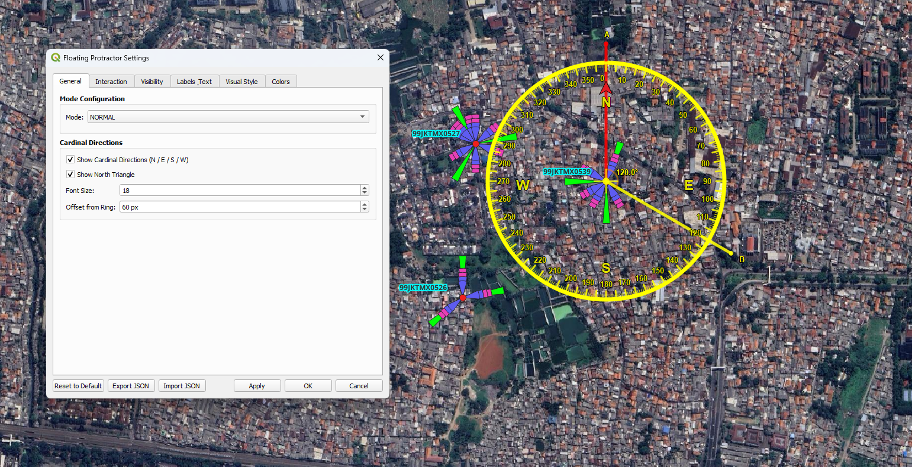

# Floating Compass  
### Persistent Floating Orientation Interface for QGIS

Floating Compass is a lightweight QGIS plugin that provides a draggable, persistent floating orientation interface directly on the map canvas.

It is designed for RF engineers, telecom planners, GIS analysts, and spatial professionals who require real-time directional awareness and fast azimuth validation without interrupting their workflow.

Unlike traditional bearing measurement utilities, Floating Compass focuses on continuous visual orientation support through a floating UI paradigm.

---

## 🚀 Key Features

- Draggable floating compass overlay
- Persistent on-canvas orientation reference
- Real-time azimuth visualization
- Snap-assisted directional alignment
- Dual-arm directional control
- Visual arc highlighting
- Right-click configuration panel
- Lightweight, canvas-safe implementation
- No external dependencies

---

## 🧠 Design Philosophy

Floating Compass is built around a workflow-centric interaction model.

Instead of functioning purely as a measurement utility, it acts as a persistent directional overlay that enhances map navigation and spatial alignment tasks.

The floating interface allows users to:
- Maintain orientation awareness at all times
- Validate sector directions visually
- Perform rapid directional checks during RF optimization
- Improve efficiency in telecom planning scenarios

---

## 📸 Screenshots

### Draggable Floating Interface

### Right Click Settings

### Settings Dialog

---

## 🛠 Technical Specifications

- Compatible with QGIS 3.22+
- CRS-aware canvas rendering
- Overlay-based architecture
- Toolbar-safe lifecycle handling
- Optimized for stable production use
- Minimal performance footprint

---

## 🎯 Primary Use Cases

- LTE / NR azimuth validation
- Sector direction verification
- RF optimization workflows
- Network rollout planning
- Field direction cross-check
- Educational GIS demonstrations

---

## 📦 Installation

Install directly from the official QGIS Plugin Repository:

Plugins → Manage and Install Plugins → Search for "Floating Compass"

---

## ⚖️ License

This plugin is released under the GNU General Public License v3.0 or later.

See the LICENSE file for details.

---

## 👨‍💻 Author

Achmad Amrulloh

Independent QGIS Plugin Developer  
Focused on workflow-driven spatial tools for telecom and RF engineering